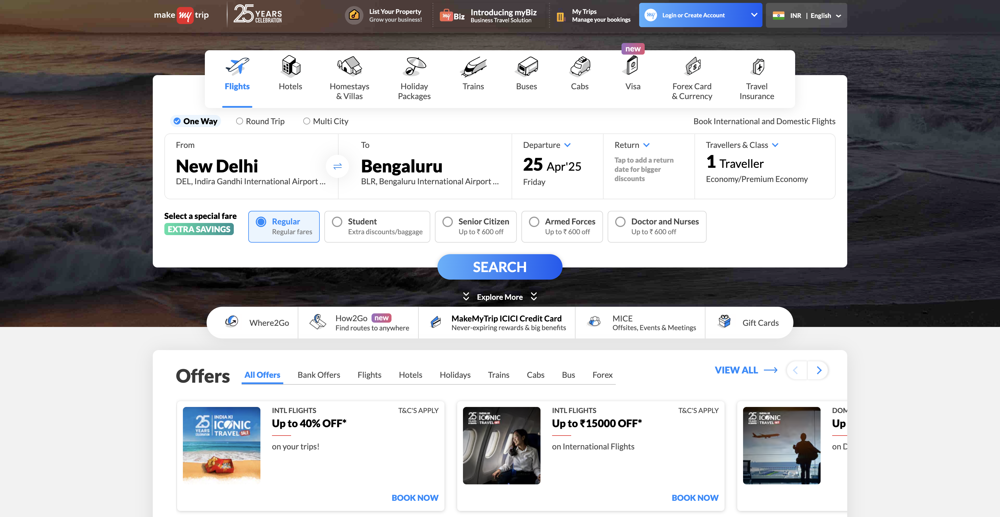
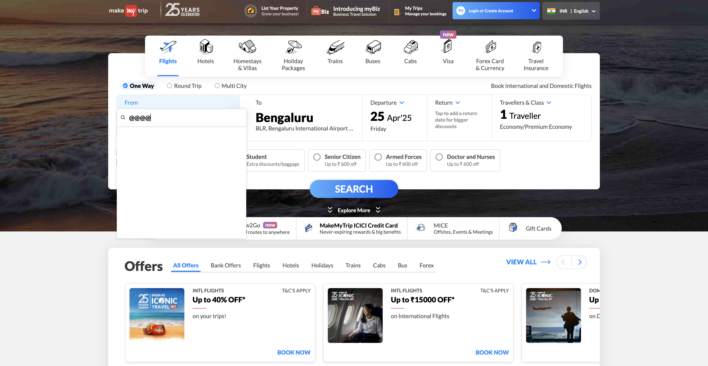
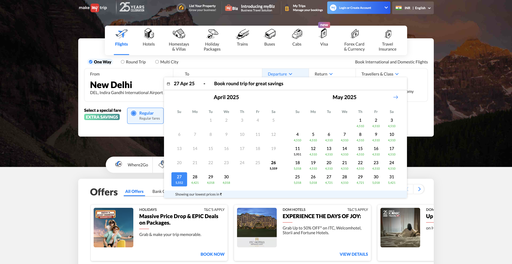

# MakeMyTrip Test Automation with Selenium

## Overview

This project contains an automated Selenium test for the **MakeMyTrip** website. The test case simulates a user journey of searching for a flight from Delhi to Mumbai, selecting a date, and then proceeding with the search. The test also handles the login popup, captures screenshots, and logs progress throughout the test.

## Prerequisites

Before running the test, ensure you have the following:
1. **Java** installed on your machine.
2. **Selenium WebDriver** set up for your browser. This project uses **ChromeDriver**.
3. **Apache Commons IO** library for file operations (e.g., saving screenshots).
4. **Chrome browser** installed.

To get started, download and set up the **ChromeDriver** that is compatible with your Chrome version.

## Dependencies

- **Selenium WebDriver** (for web automation)
- **Apache Commons IO** (for file handling)
- **ChromeDriver** (for running tests on Chrome)

You can add the necessary dependencies to your **pom.xml** if you're using Maven:

```xml
<dependency>
    <groupId>org.seleniumhq.selenium</groupId>
    <artifactId>selenium-java</artifactId>
    <version>3.141.59</version>
</dependency>
<dependency>
    <groupId>org.apache.commons</groupId>
    <artifactId>commons-io</artifactId>
    <version>2.8.0</version>
</dependency>
```

## How It Works

### 1. Initial Setup
The program starts by setting the `webdriver.chrome.driver` system property with the path to `chromedriver`. It uses `ChromeOptions` to set various configurations, including the user agent and the exclusion of automation flags to make the browser look more like a real user.

### 2. Browser Initialization
The `ChromeDriver` is initialized with the options set earlier. The browser window is maximized.

A `WebDriverWait` is used to manage waits for elements to be visible or clickable on the webpage. This improves test stability by waiting for elements instead of relying on hardcoded delays.

### 3. Test Case Execution
The test opens the **MakeMyTrip** homepage.

If a login popup appears, it is dismissed.

The test then selects the following:
- **From city**: Delhi
- **To city**: Mumbai
- **Departure date**: The next day (calculated dynamically).

After selecting the cities and date, the program clicks the **Search** button.

### 4. Handle Results
If the search results page is successfully loaded, the program clicks a **proceed** button.

If the page does not load within the specified timeout, an error message is printed, and a screenshot is captured to show the current state of the page.

Screenshots are saved to a specified directory for verification.

### 5. Test Completion
After completing the steps, a screenshot of the final state of the page is captured.

The browser is closed, and a message indicating that the test run is finished is logged.

### 6. Error Handling
The program handles potential errors, including `WebDriverException` and `TimeoutException`.

In case of errors or unexpected results, appropriate messages are printed, and screenshots are taken to assist with debugging.

## Program Flow

Here is the sequence of operations performed by the program:

### 1. Setup and Initialize WebDriver:
- Set system property for `ChromeDriver`.
- Initialize `ChromeDriver` with options.

### 2. Navigate to MakeMyTrip:
- Open the **MakeMyTrip** website.

### 3. Dismiss Login Popup (if any):
- Wait for the login popup and close it if it appears.

### 4. Select From City (Delhi):
- Click on the 'From' input field.
- Enter "Delhi" and select the first suggestion.

### 5. Select To City (Mumbai):
- Click on the 'To' input field.
- Enter "Mumbai" and select the first suggestion.

### 6. Select Date (Tomorrow):
- Calculate tomorrow’s date dynamically.
- Click on the date in the calendar that corresponds to tomorrow.

### 7. Click on Search Button:
- Click the search button to initiate the flight search.

### 8. Handle Search Results:
- Wait for the results page to load. If the page loads, proceed with clicking the final button to continue.
- If the results page does not load, print an error and capture a screenshot.

### 9. Capture Screenshots:
- Take screenshots at various points in the test to document the state of the page.

### 10. Test Completion:
- Close the browser and log a message indicating that the test has finished.

## Screenshot Capture

The program captures screenshots at key points in the test to validate the execution:
- After the search is performed.
- If the search results page does not load correctly.

Screenshots are saved in the `screenshots/` directory with names reflecting the test scenario.

### Screenshot Capture
The program captures screenshots at key points in the test to validate the execution:
- After the search is performed. 
- If the search results page does not load correctly.

Screenshots are saved in the screenshots/ directory with names reflecting the test scenario.

### Example output:

```declarative
Starting test case...
The source location as 'Delhi' is selected
The destination location as 'Mumbai' is selected
Test completed and screenshot taken.
Browser closed. Test run finished.

```

### Handling Errors
The program handles errors gracefully by:
- Catching WebDriverException for issues with the WebDriver.
- Handling TimeoutException when waiting for elements to become available.
- Capturing screenshots for debugging purposes.

## Screenshots:







## Output in the Terminal:

```declarative


May 20, 2025 10:28:13 PM org.openqa.selenium.devtools.CdpVersionFinder findNearestMatch
WARNING: Unable to find an exact match for CDP version 136, returning the closest version; found: 135; Please update to a Selenium version that supports CDP version 136
Starting Valid test case...
The source location as 'Delhi' is selected
The destination location as 'Mumbai' is selected
Search results page did not load in time.
The Result URL is:https://www.makemytrip.com/flight/search?itinerary=DEL-BOM-21/05/2025&tripType=O&paxType=A-1_C-0_I-0&intl=false&cabinClass=E&lang=eng
Result URL opened in Safari.
Safari closed automatically after 15 seconds.
Test completed and screenshot taken.
Browser closed. Test run finished for Valid Scenarios.
===============================================================================
May 20, 2025 10:30:01 PM org.openqa.selenium.devtools.CdpVersionFinder findNearestMatch
WARNING: Unable to find an exact match for CDP version 136, returning the closest version; found: 135; Please update to a Selenium version that supports CDP version 136
Starting Invalid test case 1...
The source location as 'NULL' is selected
The destination location as 'Mumbai' is selected
WebDriver Error: Expected condition failed: waiting for element to be clickable: By.xpath: //div[@aria-label='Wed May 21 2025'] (tried for 10 second(s) with 500 milliseconds interval)
Build info: version: '4.31.0', revision: '4ae8fc9f8a'
System info: os.name: 'Mac OS X', os.arch: 'aarch64', os.version: '15.5', java.version: '24'
Driver info: org.openqa.selenium.chrome.ChromeDriver
Capabilities {acceptInsecureCerts: false, browserName: chrome, browserVersion: 136.0.7103.114, chrome: {chromedriverVersion: 135.0.7049.95 (de2eb485a195..., userDataDir: /var/folders/00/7jgnh3mx72x...}, fedcm:accounts: true, goog:chromeOptions: {debuggerAddress: localhost:50540}, networkConnectionEnabled: false, pageLoadStrategy: normal, platformName: mac, proxy: Proxy(), se:cdp: ws://localhost:50540/devtoo..., se:cdpVersion: 136.0.7103.114, setWindowRect: true, strictFileInteractability: false, timeouts: {implicit: 0, pageLoad: 300000, script: 30000}, unhandledPromptBehavior: dismiss and notify, webauthn:extension:credBlob: true, webauthn:extension:largeBlob: true, webauthn:extension:minPinLength: true, webauthn:extension:prf: true, webauthn:virtualAuthenticators: true}
Session ID: 1ac0f75891e5a7b21b15c1b2896b0c44
Browser closed. Test run finished for invalid From city = NULL.
===============================================================================
May 20, 2025 10:31:18 PM org.openqa.selenium.devtools.CdpVersionFinder findNearestMatch
WARNING: Unable to find an exact match for CDP version 136, returning the closest version; found: 135; Please update to a Selenium version that supports CDP version 136
Starting Invalid test case 2...
The source location as '12345' is selected
The destination location as 'Mumbai' is selected
WebDriver Error: Expected condition failed: waiting for element to be clickable: By.xpath: //div[@aria-label='Wed May 21 2025'] (tried for 10 second(s) with 500 milliseconds interval)
Build info: version: '4.31.0', revision: '4ae8fc9f8a'
System info: os.name: 'Mac OS X', os.arch: 'aarch64', os.version: '15.5', java.version: '24'
Driver info: org.openqa.selenium.chrome.ChromeDriver
Capabilities {acceptInsecureCerts: false, browserName: chrome, browserVersion: 136.0.7103.114, chrome: {chromedriverVersion: 135.0.7049.95 (de2eb485a195..., userDataDir: /var/folders/00/7jgnh3mx72x...}, fedcm:accounts: true, goog:chromeOptions: {debuggerAddress: localhost:50677}, networkConnectionEnabled: false, pageLoadStrategy: normal, platformName: mac, proxy: Proxy(), se:cdp: ws://localhost:50677/devtoo..., se:cdpVersion: 136.0.7103.114, setWindowRect: true, strictFileInteractability: false, timeouts: {implicit: 0, pageLoad: 300000, script: 30000}, unhandledPromptBehavior: dismiss and notify, webauthn:extension:credBlob: true, webauthn:extension:largeBlob: true, webauthn:extension:minPinLength: true, webauthn:extension:prf: true, webauthn:virtualAuthenticators: true}
Session ID: 35f93bda2b42776b7d429eaf2511174c
Browser closed. Test run finished for Invalid from city = INVALID_CITY.
===============================================================================
May 20, 2025 10:32:48 PM org.openqa.selenium.devtools.CdpVersionFinder findNearestMatch
WARNING: Unable to find an exact match for CDP version 136, returning the closest version; found: 135; Please update to a Selenium version that supports CDP version 136
Starting Invalid test case 3...
The source location as 'Delhi' is selected
The destination location as 'NULL' is selected
WebDriver Error: Expected condition failed: waiting for element to be clickable: By.xpath: //div[@aria-label='Wed May 21 2025'] (tried for 10 second(s) with 500 milliseconds interval)
Build info: version: '4.31.0', revision: '4ae8fc9f8a'
System info: os.name: 'Mac OS X', os.arch: 'aarch64', os.version: '15.5', java.version: '24'
Driver info: org.openqa.selenium.chrome.ChromeDriver
Capabilities {acceptInsecureCerts: false, browserName: chrome, browserVersion: 136.0.7103.114, chrome: {chromedriverVersion: 135.0.7049.95 (de2eb485a195..., userDataDir: /var/folders/00/7jgnh3mx72x...}, fedcm:accounts: true, goog:chromeOptions: {debuggerAddress: localhost:51082}, networkConnectionEnabled: false, pageLoadStrategy: normal, platformName: mac, proxy: Proxy(), se:cdp: ws://localhost:51082/devtoo..., se:cdpVersion: 136.0.7103.114, setWindowRect: true, strictFileInteractability: false, timeouts: {implicit: 0, pageLoad: 300000, script: 30000}, unhandledPromptBehavior: dismiss and notify, webauthn:extension:credBlob: true, webauthn:extension:largeBlob: true, webauthn:extension:minPinLength: true, webauthn:extension:prf: true, webauthn:virtualAuthenticators: true}
Session ID: 8659fc8b20afbef2353c94b7d81a2111
Browser closed. Test run finished for invalid To city = NULL.
===============================================================================
May 20, 2025 10:34:17 PM org.openqa.selenium.devtools.CdpVersionFinder findNearestMatch
WARNING: Unable to find an exact match for CDP version 136, returning the closest version; found: 135; Please update to a Selenium version that supports CDP version 136
Starting Invalid test case...
The source location as 'Delhi' is selected
The destination location as '12345' is selected
WebDriver Error: Expected condition failed: waiting for element to be clickable: By.xpath: //div[@aria-label='Wed May 21 2025'] (tried for 10 second(s) with 500 milliseconds interval)
Build info: version: '4.31.0', revision: '4ae8fc9f8a'
System info: os.name: 'Mac OS X', os.arch: 'aarch64', os.version: '15.5', java.version: '24'
Driver info: org.openqa.selenium.chrome.ChromeDriver
Capabilities {acceptInsecureCerts: false, browserName: chrome, browserVersion: 136.0.7103.114, chrome: {chromedriverVersion: 135.0.7049.95 (de2eb485a195..., userDataDir: /var/folders/00/7jgnh3mx72x...}, fedcm:accounts: true, goog:chromeOptions: {debuggerAddress: localhost:51417}, networkConnectionEnabled: false, pageLoadStrategy: normal, platformName: mac, proxy: Proxy(), se:cdp: ws://localhost:51417/devtoo..., se:cdpVersion: 136.0.7103.114, setWindowRect: true, strictFileInteractability: false, timeouts: {implicit: 0, pageLoad: 300000, script: 30000}, unhandledPromptBehavior: dismiss and notify, webauthn:extension:credBlob: true, webauthn:extension:largeBlob: true, webauthn:extension:minPinLength: true, webauthn:extension:prf: true, webauthn:virtualAuthenticators: true}
Session ID: 40443f520c9c68cdb66717399a6e715a
Browser closed. Test run finished for invalid TO city = 12345.
===============================================================================
All the positive and negative test cases completed!!

Process finished with exit code 0


```